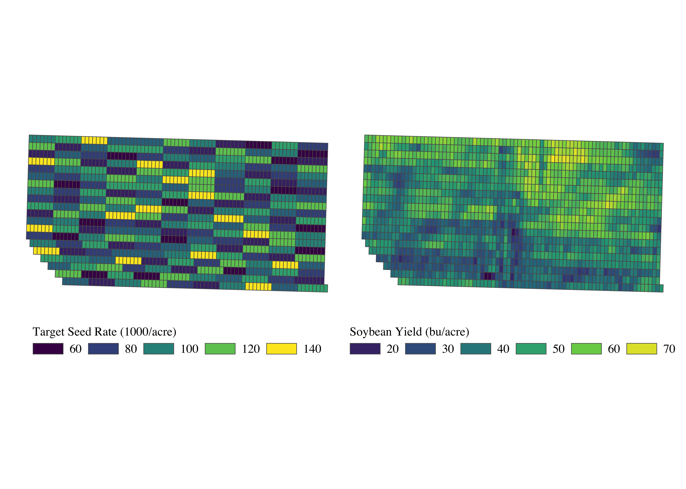

```{r setup, echo = F}
library(knitr)

opts_chunk$set(
  echo = F,
  cache = T,
  comment = NA,
  message = FALSE,
  warning = FALSE
  ) 

opts_knit$set(root.dir = "~/Dropbox/TeachingUNL/DataScience/Assignments/Assignment_2")

```

```{r packages, echo = F}
suppressMessages(library(tidyverse))
suppressMessages(library(readr))
suppressMessages(library(data.table))
suppressMessages(library(readstata13))
suppressMessages(library(future.apply))
suppressMessages(library(ggthemes))
suppressMessages(library(lubridate))
```

# Assignment Goals

In this assignment, you are asked to work on a dataset of an on-farm soybean seed rate trial (see the figure below for the seed rate trial design and yield outcome). The primary goal of the project is to identify the site-specific optimal seed rate at various combinations of soy and seed price.

This assignment is designed to train you on

+ data visualization
+ data wrangling
+ writing your own functions
+ loop
+ parallelization
+ vectorized operations
+ economic optimization 




# Importing and understanding the dataset

First, import `soybean_trial_data.rds`, which has following variables: 

```{r }
# Note: you need to modify this code unless you soybean_trial_data.rds
# is stored in the same folder as the Rmd file.
 
data <- readRDS("soybean_trial_data.rds")  
```

* `subplot_id`: observational unit
* `seed_rate`: seed rate (1000 seeds/acre) 
* `yield`: soybean yield (bu/acre)
* `ec`: electrical conductivity

`subplot_id` is the unique id value assigned to each of the grids that you can see in the maps above.  

In addition to these variables, the dataset also has `beta_int` and `beta_log_seed`. They are the coefficient estimates from running the Geographically Weighted Regression method on the following model (Note that you do not need to know what that is to do this assignment): 

$$\mbox{soybean yield} = \beta_0 + \beta_1 \mbox{log(seed rate)} + u$$

The regression analysis generated coefficients estimates for each of the subplots where `beta_int` and `beta_log_seed` corresponds to $\beta_0$ and $\beta_1$, respectively. This means that each of the subplots has its own yield response function. For example, the yield response function for the grid with `subplot_id == 1` is:

$\mbox{soybean yield =}$ `r data[1, ]$beta_int` + `r data[1, ]$beta_log_seed` $\times \mbox{log(seed rate)}$

because

```{r }
data[1, ]$beta_int 
data[1, ]$beta_log_seed
```

# Exploratory Analysis

**Q1**

`beta_log_seed` measures how responsive soybean yield is to seed rate: the higher `beta_log_seed` is, the more responsive yield is to seed rate (as long as `beta_log_seed` is positive).

Find the mean of `beta_log_seed` and group the observations into two groups where one group has lower-than-average `beta_log_seed` values and the other has higher-than-average `beta_log_seed` values. Label them as `below_average` and `above_average`, respectively. Call the variable `below_or_average`. 

---

**Q2**

Using `case_when()` and `quantile()`, group the observations into three categories:

+ `ec` lower than the 33% quantile of `ec` (label this group as `ec_low`)
+ `ec` higher than the 33% quantile of `ec`, but lower than the 67% quantile of `ec` (label this group as `ec_mid`)
+ `ec` higher than the 67% quantile of `ec` (label this group as `ec_high`)

Name the group variable `ece_group`. If you are not familiar with `quantile()` look it up yourself and figure out how to use it.

---

**Q3**

Find the mean of `yield` by `ec_group` and create a bar chart to visualize the information. Color-differentiate the bars by `ec_group`.

Do you see anything that is notable?

---

**Q4**

Create a scatter plot of `yield` (y-axis) against `beta_log_seed` (x-axis), and add a linear fit line using `geom_smooth()`. 

What do you find? Looking at the relationship what do you say about the following claim:

You should plant more seeds to the parts of the field that are more productive (high-yielding)?

---

**Q5**

Create a boxplot of `beta_log_seed` against `ec_group`. Color-differentiate the boxes by `ec_group`. By default, the boxes appear in the order of `ec_high`, `ec_low`, `ec_mid`, and `NA`. First, remove the NA category by filtering out those observations. Next, using `factor()`, make the boxes appear in the order of `ec_low`, `ec_mid`, and `ec_high`. 

Do you see anything that is notable? 

# Economic Optimization

**Q6**

Define the function that takes `beta_int`, `beta_log_seed`, and `seed_rate` and calculate `yield`. Use `gen_yield` as the function name. Then, predict yield for the subplot with `subplot_id == 10` at the seed rate of 100K/acre.

---

**Q7**

Using a for loop, find the predicted yield values for all the subplots at the seed rate of 100. (Hint: loop over the row numbers of `data`.).

In writing a for loop, create a storage of predicted yield values you will be calculating like below:


Then, within the loop, assign the calculated yield value to `yield_store` for each iteration. 

---

**Q7**

Using `lapply()` and `gen_yield()` find the predicted yield values for all the subplots at the seed rate of 100 (Hint: loop over the row numbers of `data`.).

Apply `unlist()` to the resulting list of values so you have a vector of yield values instead of a `list`.

---

**Q8**

Calculating yields for all the subplots can be easily vectorized. Use a vectorized operation to calculate yields using `gen_yield()` at the seed rate of 100. In doing so, do this calculation inside `data` and name the predicted yield variable `pred_yield`. After the calculation, relocate `pred_yield` to the front and use `head()` to print the first 6 observations.

---

**Q9**

We would like to find the optimal seed rate for each subplot at

+ soybean price: $9/bu
+ seed price: $0.35/1000 seeds

```{r echo = T}
soy_price <- 9
seed_price <- 0.35 
```

We will use a grid search method. That is, we will create a sequence of seed rates, find profits, and then select the seed rate that yield the highest profit. 

Create the sequence of seed rates that ranges from the minimum and maximum experimental seed rates with the incremental step of 0.2. Name the sequence `seed_seq`.

**Q10**

We will work on a single plot first instead of working on the entire observations at the same time. 

+ Select (`select()`) only `subplot_id`, `beta_int`, and `beta_log_seed` from `data`
+ Filter the data to the subplot with `subplot == 1` and replicate the observations `length(seed_seq)` of times using `slice()`
+ Create a variable that holds `seed_seq` as its values
+ Save the data as `eval_data`

**Q11** 

Now that you have created a dataset with all possible values of seed rates you want to look at. You can use vectorized operations (like you did in **Q8**) to calculate profit and identify the economically optimal seed rate. Go through the following steps:

+ Calculate yields for each row using `gen_yield()`
+ Calculate profits for each row using the following formula:
  
$$\mbox{profit} = \mbox{soy price} \times \mbox{yield} - \mbox{seed price} \times \mbox{seed rate}$$

+ Identify the seed rate that maximizes the profit


**Q12**

Now, we would like to find the economically optimal seed rate for all the subplots at the same time. 

The first step is to create a `data.frame` that looks like `eval_data` but for all the subplots. So, it should look like a vertically stacked `eval_data` for all the individual subplots.

+ Select (`select()`) only `subplot_id`, `beta_int`, and `beta_log_seed` from `data`
+ Replicate the observations `length(seed_seq)` of times for each subplot 
+ Create a variable that holds `seed_seq` as its values so that each subplot has all the seed rate values to be evaluated at
+ Save the data as `eval_data_all`


Now calculate profits for all the seed rates for all the subplots and identify the economically optimal seed rate for each subplot. 

Finally, create a histrogram of the optimal seed rates.

**Q13**

Now, we would like to find the economically optimal seed rate at various combinations of soy price and seed price to understand the sensitivity of the optimal seed rates to them.  

Here are the sequence of soy and seed prices:

It would be nice to implement similar tactics as we did in **Q12** where all the possible combinations of parameters are generated as a single `data.frame`, which makes it possible to do everything vectorized without resorting to looping.

Looking at the size of `eval_data_all`, which is for single price combination, the memory profile of the evaluation data is 

If we were to create a single evaluation dataset for all the combinations of soy price, seed price, and seed rates, then what would be approximate size of the data?   

**Q14**

Given our assessment of the size of the single evaluation data, we have decided to do the job chunk by chunk, where each chunk works on a single combination of soy and seed prices. 
  
Create a `data.frame` of the complete combinations of seed and soy prices that has `soy_price` and `seed_price` as columns using `expand.grid()`. Name the `data.frame` `par_data`.

Now, write a function that takes the row number value, extract `soy_price` and `seed_price` from the row of `par_data`. Call the function `get_opt_S`. Note that you can use `eval_data_all` inside the function. Make sure that the dataset you are returning in each iteration records `soy_price` and `seed_price`. Confirm that the function works by running `get_opt_S(100)`. 

Now loop over the rows of `par_data` to get the site-specific seed rates for all the combinations of soy price and seed price. Use `bind_rows()` to combine the list of `data.frame`s.

**Q15**

Using `lapply()` took too long to run. So, use `future_lapply()` to process the tasks in parallel.

**Q16**

Calculate the mean profit/acre by soy price and seed price.  

While we have been calling the difference between the revenue less the cost of seed profit, it is actually not because we have other non-seed costs. Suppose the total non-seed cost is $400/acre. Subtract 400 from the "profits" to get the true profits.

Then, create a heat map with `soy_price` on the y-axis, `seed_price` on the x-axis, and fill color differentiated by `profit`.


